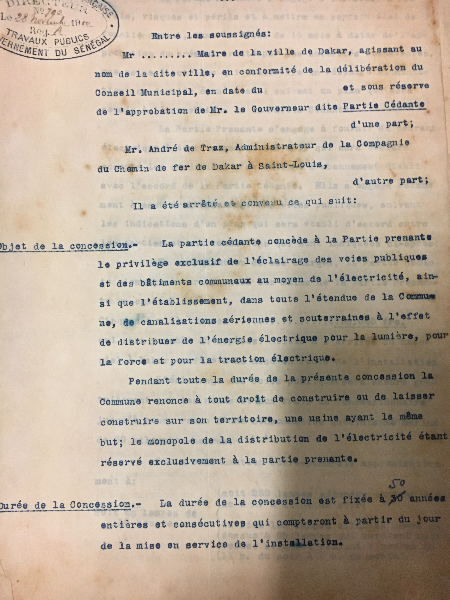

# Electricity

This page contains [general information](#overview) about electricity access in Senegal, some statements on what [electricity might be able to teach us about inequality in Senegal](#electricity-and-inequality) and information about the [history of the Dakar electric grid](#history) taken from documents found at the Senegal National Archives in Medina.

## Overview
Senegal's national electric agency tasked with providing electricity to urban areas is called SENELEC and provides 63% of the total grid electric capacity of Senegal. Private, independent companies provide 37% of the total electric capacity.[^1]

Rural electricity is managed by an organization called ASER and depends on energy delivered off of the main power grid by diesel powered generators. Less than 30% of the rural population of Senegal has access to electricity, which is below the target availability level for 2015.[^2]

## Electricity and inequality
Even when rural households are directly over an electric line, they may not be electrified due to limited incomes or due to a lifestyle that doesn't currently involve many activities that would benefit from electricity. However when rural areas are electrified, demand has increased. After electricity became available at two population centers in the Leone region, there was a large increase in "commercial activities, such as dressmaking, carpentry, welding, and
commerce, which require electricity".[^3]

One important factor to consider that is missing from some of the electricity planning literature is that villages tend to share resources like televisions and other appliances, so even if relatively few people have personal access to electricity in their household, they may have access within their community, which would allow them to engaged in personal or maybe even commercial activities that require electricity.

There are two big takeaways from the electricity situation in Senegal with respect to inequality. One is that due to the difficult nature of electric infrastructure planning, the more people using a grid, the easier it is to plan how it will be used, and therefore easier to invest in improving infrastructure, so electricity investment tends to become entrenched. The electric lines also demonstrate that the **mere presence of a physical utility line in close proximity does not mean that residents will actually have better access.** Access to utilities like electricity also requires reasonable pricing and knowledge of how the utility may improve the lifestyle of the residents.

One of the problems inherit in electricity planning for the rural areas is that diesel generators track the price of oil, and as a result are susceptible to relatively large fluctuations. The actual grid is often more robust than the decentralized diesel stations, but there is evidence to suggest that grid expansion is only cost-effective for between 20% - 50% of people living in rural areas, in particular those in population centers of 5000+ people.

## History
### First electric commission in Dakar (1904)
In order to learn more about the history of the electric grid of Senegal, some research was conducted in the National Archives in Medina. The earliest planning document about the electric grid is a 1904 letter from

It appears that the chief purpose of the creation of the grid was to provide public lighting and improve reliability of telegram. The Mayor of Dakar at the time was also very involved, and needed to approve all parts of the process.

[^1]: A Sanoh et. all, Energy for Sustainable Development, page 16
[^2]: Ibid, page 16
[^3]: Ibid, page 18
