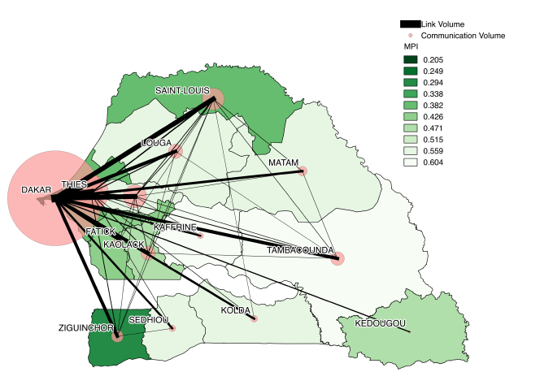

# The Role of Utilities
This site exists to investigate whether access to and physical placement of public utilities, particularly [water](water.md), [electricity](electricity.md), and [telecommunications](telecom.md) can help us better understand poverty in Senegal.

|  |  | |
|:--:|:--:|:--:|
| *Cellular activity* | *Electric Grid*| *Hydrogeology Map of Senegal*|

## Abstract and Findings
Each of the three utilities have different lessons to teach us about inequality in the republic of Senegal.

[Water](water.md) helps us map need, and where people are furthest away from obtaining their basic needs.

(Add water findings here)

[Telecommunications](telecom.md) and [electricity](electricity.md) demonstrate where information-based wealth is and gives us unprecedented granularity for understanding and mapping poverty. Telecom also demonstrates how infrastructure can influence conditions in regions in Senegal in addition to helping us study them.

One of the most striking insights from looking at telecommunications in Senegal is the capacity to train models to produce higher resolution poverty maps than were previously thought possible.

(Add electricity findings here)

## What do we mean by inequality, and how do we measure it?
From access to public services like healthcare to educational attainment and income disparity, there are a number of ways to measure poverty and inequality. The metric used to measure poverty for this project is [MPI](https://en.wikipedia.org/wiki/Multidimensional_Poverty_Index), which is a widely-used metric designed to measure acute poverty.[^1] Higher MPI indicates greater poverty and lower access to resources, while lower MPI indicates the inverse.

|  |
|:--:|
| *MPI Map of Senegal[^1]* |

Inequality between the wealthy and the middle class in Senegal may also have an interesting relationship with the placement of and access to utilities, but it is very difficult to make statements about actual happiness and life satisfaction after a certain income level, while there is good evidence to support that lack of access to basic needs like healthcare, education, and sanitation cause people to report lower life satisfaction and greater emotional pain when bad things occur[^20]

While one of the great advantages of MPI is that it is designed to be robust to decomposition within the relevant sub-groups of populations like urban vs. rural, geographic regions, ethnicity, and gender, and the data it depends on is available with high fidelity in Senegal[^30], calculation of MPI is partially based on access to water and electricity which may bias some of the findings on this site to have a stronger correlation with MPI than if those factors were controlled for. Fortunately, access to water and electricity alone make up relatively small portions of the MPI calculation[^40]

## Footnotes
[^1]: http://blog.weebi.com/a-mapping-with-a-meaning/
[^10]: http://www.ophi.org.uk/wp-content/uploads/MPI_2011_Methodology_Note_4-11-2011_1500.pdf?cda6c1
[^20]: https://www.ncbi.nlm.nih.gov/pmc/articles/PMC2944762/
[^30]: https://arxiv.org/abs/1506.03401, page 2
[^40]: Electricity and water make up (1/18th) of the MPI calculation respectively, while factors like access to education make up (1/6th)
