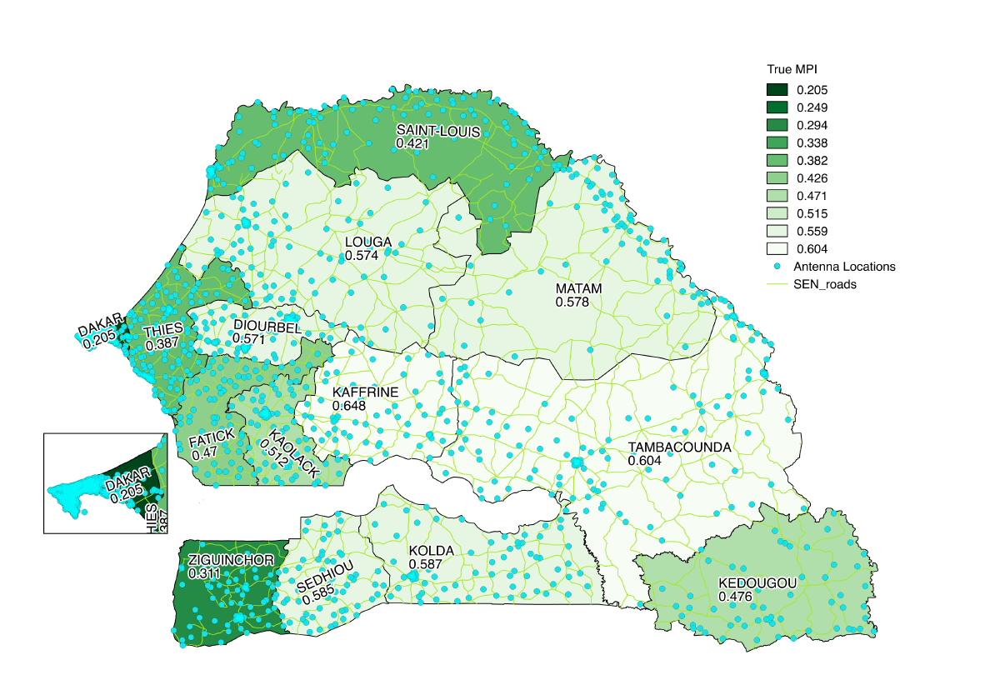
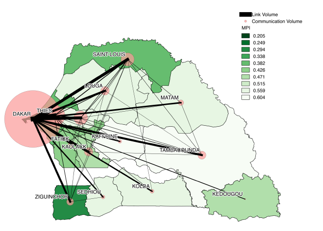
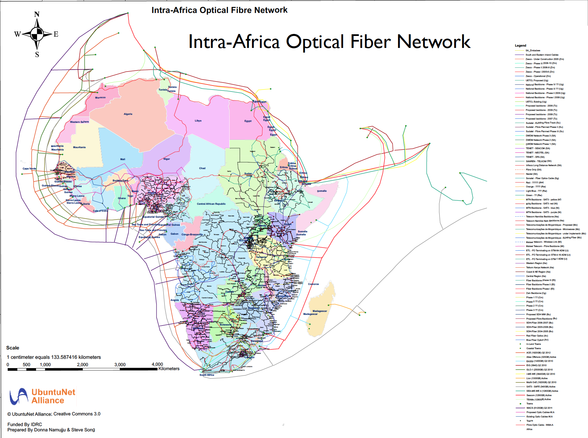

# Telecommunications

This page contains more information about the [Fiber Optic Cable System](#fiber-optics), 

## Cellular and Poverty

- Images from really great paper by Computer Science Department at SUNY Buffalo.

- Paper finds excellent correlation between network centrality and MPI in Senegal

- Dakar has a strong influence on the MPI/Cell-tower correlation, but not when you take into account specific behaviors

- Centrality is the importance of a network, in this case determined by flow. Describe Activity, Eigenvector, and PageRank and what each one actually means in practice. (Why Eigenvector is better than Activity, etc.)

- Cell tower work allows for higher granularity poverty maps

- Areas that don't correlate well with MPI do have a fiber optic cable running through them.

- Paper only uses Orange data. Tigo and Expresso have footholds in regions x, y, and z and market share of a and b respectively. The addition of the data from these providers would likely increase the

| Senegal Fiber | [Wider Africa]()[^2] |
|--|--|
|  |  |

## Fiber Optics
The internet is a series of tubes,[^1] and some of those tubes go through Senegal:

| Senegal | [Wider Africa]()[^2] |
|--|--|
|  |  |

### What do these maps mean?

The map on the left displays the large underground telecommunications cables that run through Senegal, and the map on the right shows how those cables connect to the rest of Africa and beyond.

The green line that passes from Dakar to Saint Louis and skirts around the border of Louga is the Sonatel fiber optics cable. The red line that goes through Dakar, Saint Louis, Tambacounda, and Ziguinchorr is a x fiber optic line, capable of x output per second.
The dark blue line that comes out of Dakar and cuts through the middle of Senegal is a large optic cable that isn't necessarily fiber (unclear from the diagram)

Fiber optic cables don't only serve wifi connections but are also serve a significant percentage of cell towers. If you're accessing this webpage in Senegal, there is a high probability that the data sent between you and the server went through one of the cables in this diagram.

### What can fiber optic cables tell us?
The Fiber Optic cables are telling because they show where the government of Senegal and large semi-public stakeholders like Sonatel think connectivity to telecommunications services is most important. There are definitely external factors influencing the placement of the cables, like connections with other nations and natural barriers, but the lines go reliably through the major cities of Dakar, Thies, and Saint-Louis, as well as other populous areas like Tambacounda.

Not only do the fiber optic cables tell us where planners think the information centers of the country are, they also can turn areas that are otherwise struggling into information centers as discussed in the case of Zinguinchor

#### Internet/Bandwidth

- https://tradingeconomics.com/senegal/international-internet-bandwidth-mbps-wb-data.html

#### Cellular Map

- https://www.nperf.com/en/map/SN/-/49.Orange/signal/?ll=14.33651725732605&lg=-14.466950836181695&zoom=7

### Large Maps

- Orange: 203 243 collected data since 01/01/2017 in displayed area.
Last update : 01/23/2018 17:43

- Expresso: 26 845 collected data since 01/03/2017 in displayed area.
Last update : 01/23/2018 17:24

- Tigo: 32 862 collected data since 01/07/2017 in displayed area.
Last update : 01/22/2018 07:28

### Dakar maps

### Rural maps

[^1]: U.S Senator Ted Stevens of Alaska
[^2]: Add Intra Africa Cable map citation here
