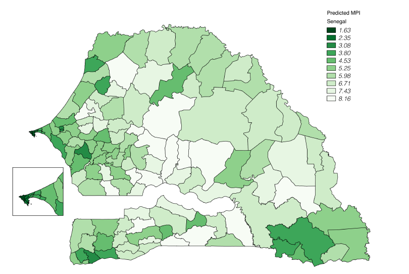

# Telecommunications

This page contains more information about the [Fiber Optic Cable System](#fiber-optics), a specific investigation on how [cellular activity might be used to map poverty at high resolution](#mapping-poverty-with-cellular-data), and a [brief history](#history) of telecom in Senegal to give the analysis context.

## Overview
Mobile data is incredibly popular in Senegal. There are 98.68 mobile subscriptions per 100 people[^12], 85% of the total population of Senegal is covered by some kind of mobile network, 20.9% of people are internet users and Telecommunications makes up almost 10% of GDP.

## Mapping Poverty with Cellular Data
Researchers at the Department of Computer Science at SUNY Buffalo found an incredibly strong correlation between [MPI](index.md#what-do-we-mean-by-inequality-and-how-do-we-measure-it) and the communications volume of various regions.

|  | Cell Towers overlaid with normal MPI |
|:--:|:--:|
| | Link and communication volume overlaid with normal MPI |

While the results were excellent in terms mapping the information wealth of the country, the correlation of raw communication and link volume with MPI was not resistant to the removal of Dakar from the dataset. However, when they looked at behavioral metrics, specifically outbound calls between 8pm and 12pm, they found a very strong correlation (0.92 r) with MPI.

Centrality is the "importance" of a node in a network. In this case the nodes are the major regions of Senegal and the connections are mobile telephone traffic between regions. In this case the metric of "activity" which is the net flow into a node from other nodes was not as well correlated with MPI as eigenvector centrality, which was not as well correlated as the most highly correlated algorithm in the paper which was page rank. Upon inspection though, it seems like the benefits of using page rank over eigenvector neutrality were quite marginal.

| Normal MPI map | Cellular Model MPI Map |
|:--:|:--:|
| |  |

There are a number of issues with the paper's methodology however. For one, the paper's dataset is only Orange data and only contains calls within Dakar.

Tigo and Expresso have footholds in Dakar and St. Louis, and to a lesser extent in Zinguinchor and Tambacounda. Tigo and Expresso had market share of 23% and 21% respectively as of 2017. The addition of the data from these providers would likely increase the centrality of Dakar, St. Louis, Zinguinchor, and Tambacounda beyond that of the existing model, which would likely have the affect of making the areas not covered by Tigo and Expresso correlate more strongly with a lower MPI.

| Tigo Coverage | Expresso Coverage |
|:--:|:--:|
| | |

An constantly updated map with cellular data from all three providers can be found [here](https://www.nperf.com/en/map/SN/-/49.Orange/signal/?ll=14.33651725732605&lg=-14.466950836181695&zoom=7).

In addition, because of the large amount of foreign calls in Senegal (remittances from Senegalese living abroad make up about 10% of GDP), it is possible that the actual number of outbound calls is poorly represented in the dataset used by the paper.

| Cell Tower Connectivity |  Senegal Fiber |
|:--:|:--:|
|  |  |

Notice that Tambacounda's MPI is high compared to others with similar levels of connectivity. Because many of the cell towers in Senegal are ultimately served by fiber optic cables[^2] it is possible that cellular service is much better in the Tambacounda region because of the proximity to the main fiber lines.

Fortunately the researchers recently received a grant from the Bill and Melinda Gates foundation to increase the resolution of their model and test their findings.

## Fiber Optics
The internet is a series of tubes,[^1] and some of those tubes go through Senegal:

| Senegal | Wider Africa[^3] |
|--|--|
|  |  |

### What do these maps mean?

The map on the left displays the large underground telecommunications cables that run through Senegal, and the map on the right shows how those cables connect to the rest of Africa and beyond.

The green line that passes from Dakar to Saint Louis and skirts around the border of Louga is the Sonatel fiber optics cable. The red line that goes through Dakar, Saint Louis, Tambacounda, and Ziguinchorr is a x fiber optic line, capable of x output per second.
The dark blue line that comes out of Dakar and cuts through the middle of Senegal is a large optic cable that isn't necessarily fiber (unclear from the diagram)

Fiber optic cables don't only serve wifi connections but are also serve a significant percentage of cell towers. If you're accessing this webpage in Senegal, there is a high probability that the data sent between you and the server went through one of the cables in this diagram.

### What can fiber optic cables tell us?
The Fiber Optic cables are telling because they show where the government of Senegal and large semi-public stakeholders like Sonatel think connectivity to telecommunications services is most important. There are definitely external factors influencing the placement of the cables, like connections with other nations and natural barriers, but the lines go reliably through the major cities of Dakar, Thies, and Saint-Louis, as well as other populous areas like Tambacounda.

Not only do the fiber optic cables tell us where planners think the information centers of the country are, they also can turn areas that are otherwise struggling into information centers as discussed in the case of Zinguinchor

## History
Sonatel was Senegal's state-owned telecom provider until 1997 when it was privatized. The fiber optic cables were laid throughout the late 1990s and early 2000s.

Orange was dominant in Senegal until 2011, when Tigo and Expresso began competing. However even today only urban areas are truly competitive.

## Footnotes
[^12]: https://tradingeconomics.com/senegal/international-internet-bandwidth-mbps-wb-data.html
[^1]: U.S Senator Ted Stevens of Alaska
[^2]: Add Intra Africa Cable map citation here
[^3]:http://gu.friends-partners.org/Global_University/Global%20University%20System/List%20Distributions/2012/MTI2312_20120412/Intra-Africa_Fibre_Map_v6-A%20copy.pdf
[^4]:https://www.cia.gov/library/publications/the-world-factbook/fields/2124.html
