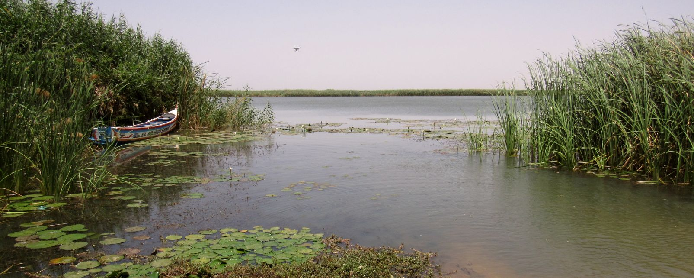

# Water
> Drinking water is like washing out your insides. The water will cleanse the system, fill you up, decrease your caloric load and improve the function of all your tissues.[^1]

This page will discuss the [current state of water access in Senegal](#overview), the [water sources](#water-sources) that Senegal draws upon to provide water to residents, and some statements on [what water might be able to teach us about inequality in Senegal](#water-and-inequality)

## Overview
The modern history of the Senegalese water system begins in 1971 when the Senegalese national water company is founded. In 1996, the water industry denationalized the public drinking water system and engages in a public-private partnership with Senegalaise des Eaux (SDE), a subsidiary of Saur International for urban areas and a number of small partnerships for rural areas.[^2]

Rural drinking water is mainly disconnected from the main pipes and water systems that go through Dakar, and show 

While the quality of and access to urban and rural drinking water as well as urban sanitation is meeting government goals quite well, **rural sanitation** is lagging behind substantially.[^3]

Most of the wastewater in Dakar is expelled without treatment into the Atlantic Ocean.

## Water sources

**Lac Guiers**

The main source of public water in Senegal is the Senegal River, and the Lac de Guiers that reservoir that the Senegal River feeds into provides the majority of the water for Dakar. Some of the water used for agricultural and industrial purposes in Senegal comes from underground water sources found in places like the Casamance.

## Water and Inequality
In addition to water access, a big problem with the rural drinking water in Senegal is the water quality. Particularly in the central and southern regions of senegal, where salinity level and flouride, chloride, and iron content of the water is not in line with World Health Organization standards [^4]

The water system in Senegal, particularly the disparity in the quality of sanitation and drinking water between the urban and rural areas despite increasing access, demonstrates that for a utility with multiple dimensions like water, which aspect you decide to measure matters a great deal in determining what is ultimately shown.

## Footnotes

[^1]: Kevin R. Stone via [Brainyquote](https://www.brainyquote.com/quotes/kevin_r_stone_561866)
[^2]:
[^3]:
